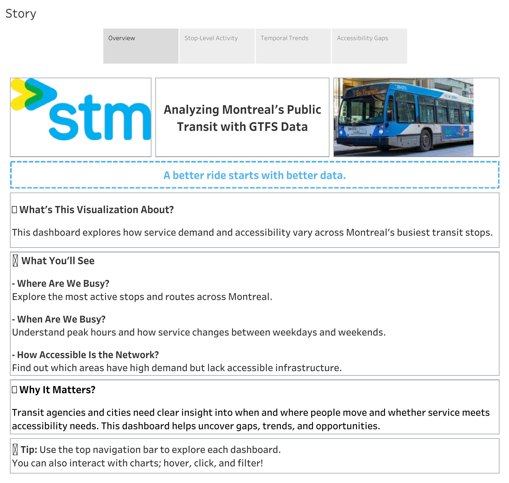
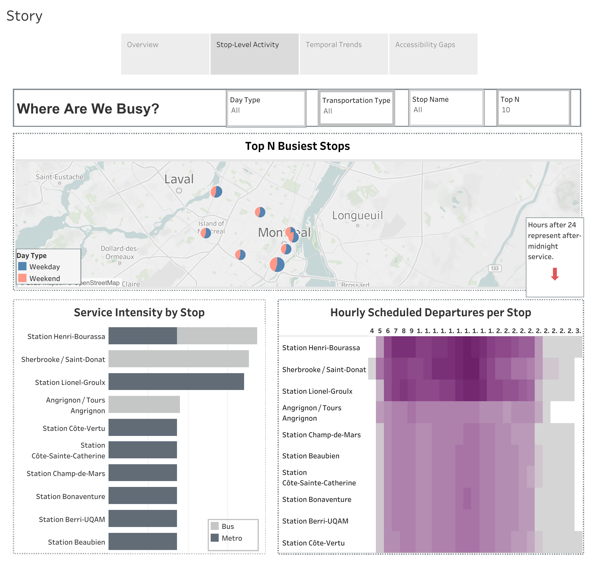
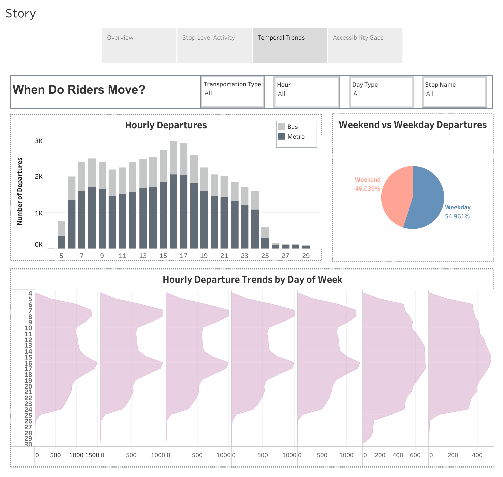
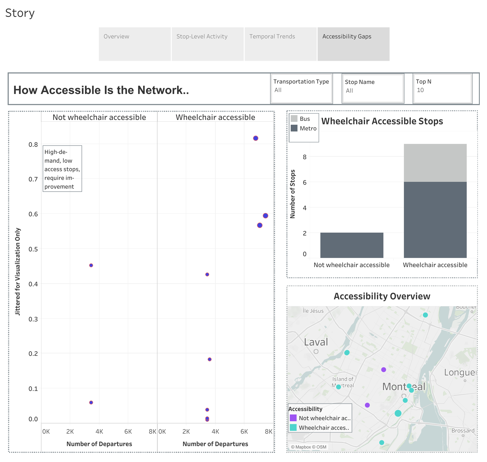

# Montreal Public Transit Data Project

This project delivers a **full-stack** analysis of Montreal’s public transit system by leveraging **GTFS schedule data**. It covers **data extraction, preprocessing, exploratory analysis, forecasting, SQL-based insights, and final visualizations in Tableau.**

⚠️ **Disclaimer:** The Transit Public API is used for demonstration purposes only. No static or real-time, public or private data from Transitapp was retrieved, used, stored, or analyzed.

⚠️ **License Note:** The GTFS data used in this project is sourced from STM and subject to their terms of use. Data is shared here for educational and non-commercial purposes.

⚠️ **Note:** The stop_times.txt file (part of GTFS) exceeds GitHub's size limit and therefore the GTFS directory is excluded from this repository. You can download the full GTFS dataset directly from STM's official site here:
https://www.stm.info/en/about/developers


## 🔹 Project Overview

### 1. Transit_API_Data_Extraction.ipynb

Demonstrates how to collect transit route, stop, and network metadata using the Transit Public API.

**Note:** This notebook is created strictly for demonstration purposes. No static or real-time, public or private data from Transitapp was retrieved, used, stored, or analyzed.

**Endpoints accessed:**

- /public/nearby_routes

- /public/nearby_stops

- /public/available_networks

### 2. GTFS_Data_Analysis.ipynb

Analyzes Montreal’s GTFS static feed by:

Merging key GTFS files: stops, trips, stop_times, routes


Performing exploratory analysis to identify:

- Departure frequency per stop

- Route and direction coverage

- Accessibility across the network

### 3. Forecasting_Stop_Level_Departures.ipynb

Forecasts hourly departures at the stop level:

- Aggregates GTFS data by stop and hour

- Creates time-based and stop-level features (rolling averages, lags, peak-hour flags)

- Trains an ML model using the busiest stops

- Evaluates model performance and feature importance

- Exports gtfs_selective_columns.csv for SQL and Tableau

### 4. /SQL/ Directory

SQL files explore patterns across:

- **Transit Traffic** : busiest stops and active routes

- **Temporal Dynamics** : hourly trends and weekday/weekend differences

- **Accessibility** : route-level accessibility rates and gaps

All .sql files contain inline comments with query results. Summary insights are compiled in **Transit_SQL_Findings.txt.**

### 5. /Tableau/ Directory

Contains dashboards and findings built in Tableau:

- **transit_viz.twb** and **transit_viz.twbx**: full workbooks with 4 dashboards in the "Story" tab

- **Tableau_Visualization_Findings.txt**: written summary of the Tableau insights

Dashboards reflect and visualize outputs from the SQL and Python analyses.

## Interactive Tableau Story

You can explore the full interactive Tableau Story here:

👉 [View on Tableau Public](https://public.tableau.com/views/GTFSMontreal-Top30BusiestStops/Story)


## Project Snapshots

Below are the four dashboards included in the Tableau story, visualized as static snapshots. These views showcase the top 10 busiest stops, but the number of stops displayed can be adjusted dynamically using a **'Top N' parameter** in the Tableau story.

#### Overview Dashboard



#### Stop-Level Activity



#### Temporal Trends



#### Accessibility Gaps




## 📦 Data Sources

- GTFS Static Feed (from STM)

Stored in the /gtfs/ directory. Key files include:

**routes.txt, trips.txt, stop_times.txt, stops.txt, calendar.txt, and more**

**Source: Société de transport de Montréal (STM)**

gtfs_selective_columns.csv

Created by the forecasting notebook

Contains features and summaries for the top 30 busiest stops

## ⚙️ Setup Instructions

### ✅ Prerequisites

Ensure you have the following installed:
```
Python 3.x

Jupyter Notebook

Tableau (Public or Desktop)

PostgreSQL (for optional SQL integration)
```

### 📥 Installation Steps

Step 1: Create a virtual environment
```
python -m venv transit-env
```

Step 2: Activate the environment

Windows:
```
.\transit-env\Scripts\activate
```

Mac/Linux:
```
source transit-env/bin/activate
```

Step 3: Install dependencies
```
pip install -r requirements.txt
```

### 📩 Connect With Me
If you're interested in discussing this project or opportunities, feel free to connect! 🚀

💼 LinkedIn: [https://www.linkedin.com/in/nedaetebari/]

**🚨 Disclaimer:** This project uses the Transit API for demonstration only. No static or real-time, public or private data from Transitapp was retrieved, used, stored, or analyzed.